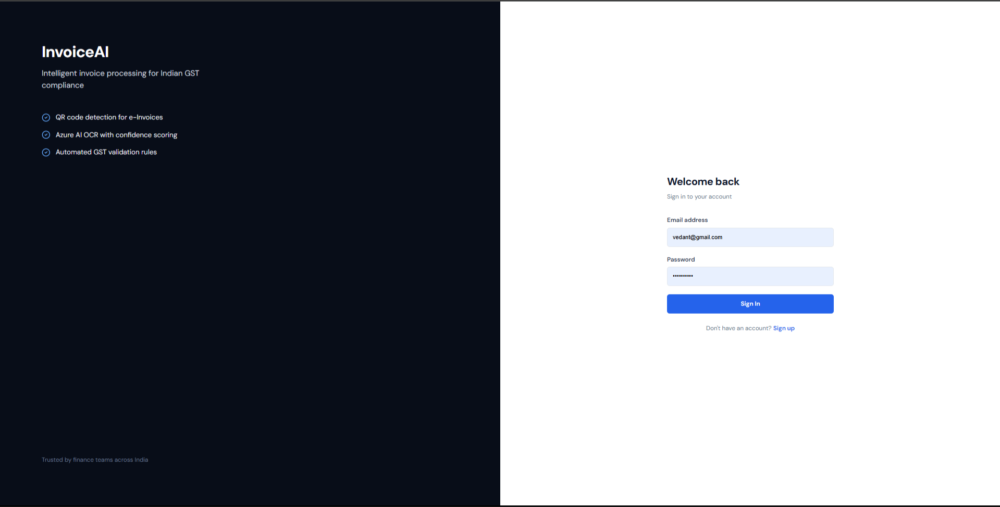
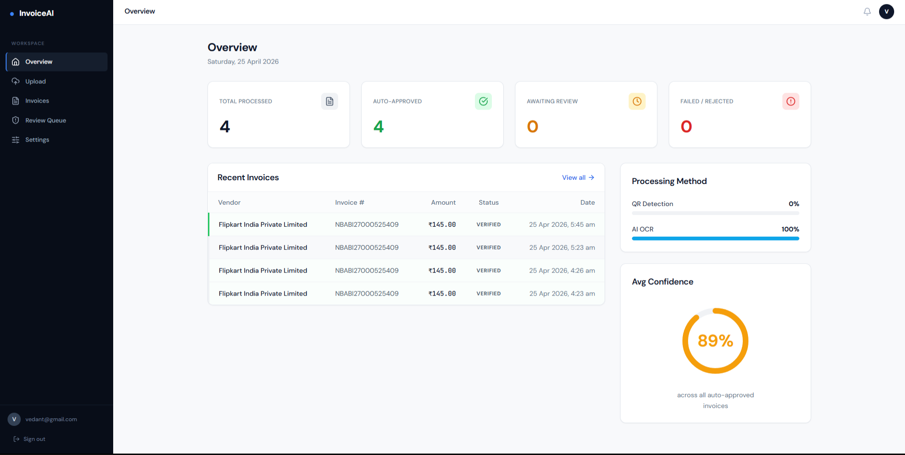
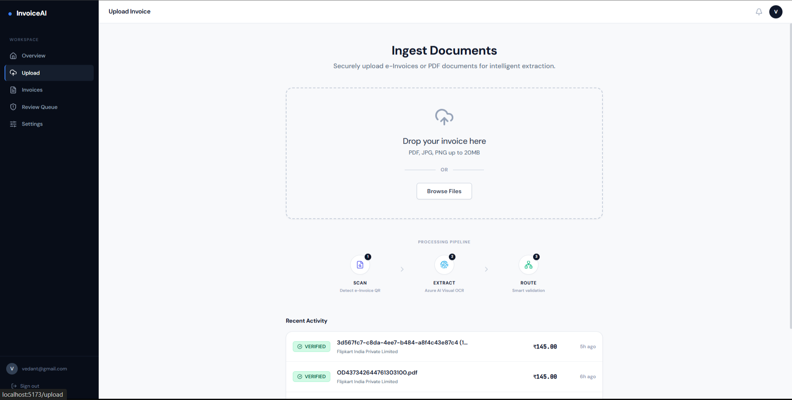
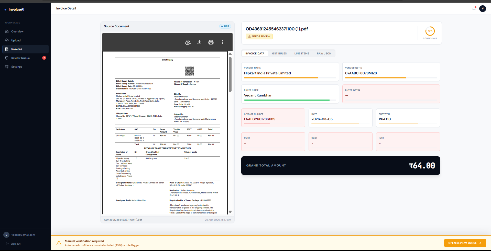
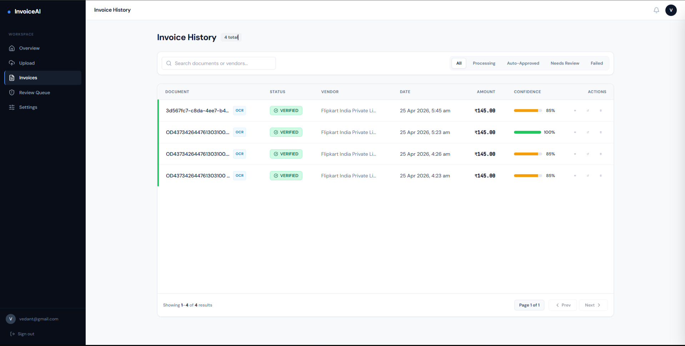
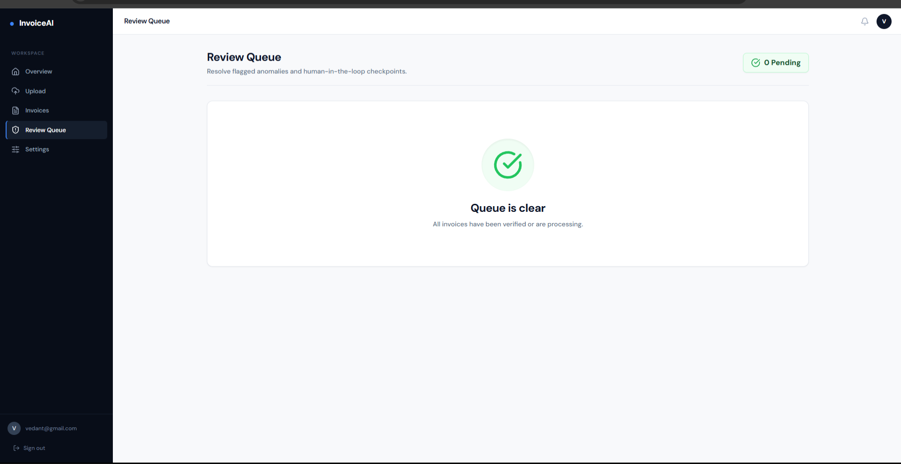
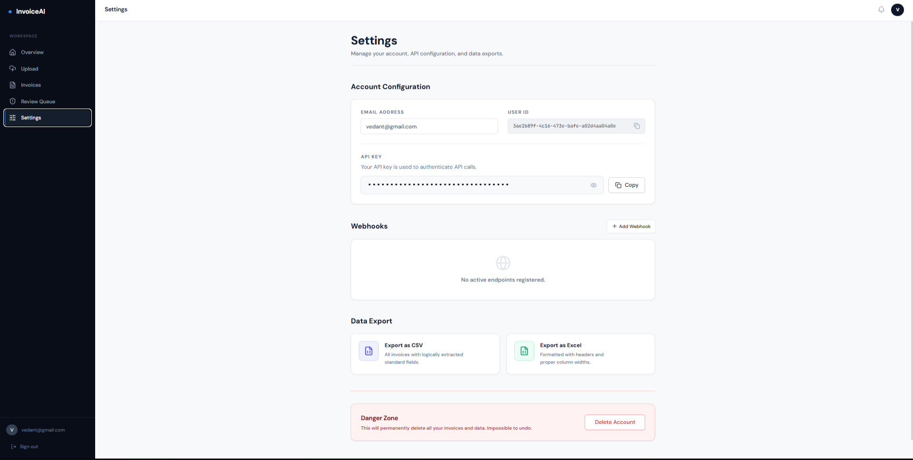
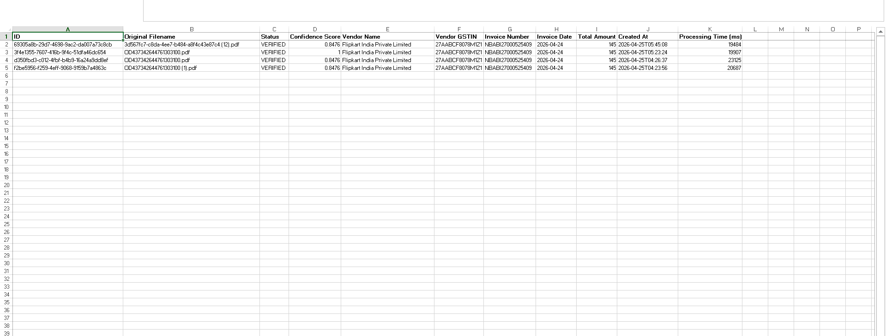

<div align="center">

# ⚡ InvoiceAI
### Enterprise-Grade GST Invoice Processing Platform

[](https://fastapi.tiangolo.com/)
[](https://react.dev/)
[](https://azure.microsoft.com/)
[](https://python.org/)
[](LICENSE)

> **Automate GST invoice ingestion, QR decoding, OCR extraction, compliance validation, and human review — all in one platform.**

</div>

---

## 📸 Platform Screenshots

| Login | Dashboard |
|-------|-----------|
|  |  |

| Upload Invoice | Processing |
|----------------|------------|
|  |  |

| Invoice History | Human Review |
|-----------------|--------------|
|  |  |

| Review Queue | Settings |
|--------------|----------|
|  |  |

| Excel Export |
|-------------|
|  |

---

## 🌟 What InvoiceAI Does

InvoiceAI is a **full-stack, production-hardened** invoice processing platform built specifically for Indian GST compliance. Upload a PDF invoice and the system:

1. 🔍 **Decodes GST e-Invoice QR codes** in real-time using a 3-layer Windows-native decoder stack
2. 🤖 **Runs Azure Document Intelligence OCR** as a fallback for non-QR invoices
3. ✅ **Validates GST compliance rules** — GSTIN format, tax math, line-item totals, place of supply
4. 📊 **Computes confidence scores** and flags low-confidence extractions for human review
5. 👤 **Queues flagged invoices** for human override with a full side-by-side review panel
6. 📁 **Exports to Excel** for downstream accounting workflows
7. 🔒 **Secures all file access** with time-limited Azure SAS URLs (no raw blob exposure)

---

## 🚀 Key Features

### 🔬 Intelligent Data Extraction
- **GST QR Decoder** — 3-layer fallback: `zxing-cpp` (Windows-native) → OpenCV WeChat ML → OpenCV standard
- **Azure Document Intelligence** — Pre-built invoice model extracts vendor, buyer, GSTIN, line items, taxes, totals
- **Multi-format support** — PDF, JPEG, PNG
- **Confidence scoring** per field with visual progress bars

### 📋 GST Compliance Engine
- GSTIN format validation (regex + checksum)
- Tax math verification: CGST + SGST + IGST = Total
- Line-item subtotal cross-check
- Invoice date range validation (configurable max age)
- Place of supply detection

### 🧑‍⚖️ Human Review Workflow
- Invoices below confidence threshold → `NEEDS_REVIEW` queue
- Side-by-side PDF viewer + editable form
- Approve as-is / Edit & approve / Reject actions
- Full audit log with diff-only storage (GDPR-efficient)

### 🔒 Security Hardening (22-point plan)
- JWT access + refresh token authentication
- Bcrypt password hashing
- **VUL-01**: Time-limited SAS URLs — raw Azure blob URLs never exposed to clients
- **VUL-03**: SSRF protection on external URL downloads (capped at 5 MB)
- Idempotency keys prevent duplicate invoice uploads
- CORS hardened to explicit origins only
- 20 MB Content-Length limit middleware
- `Content-Disposition: inline` on SAS URLs (no auto-download)

### ⚡ Performance & Reliability
- Asynchronous processing via FastAPI `BackgroundTasks`
- 10-minute polling timeout with auto-escalation to `HUMAN_REQUIRED`
- SQLite for local dev, PostgreSQL-ready connection pool
- Redis-ready rate limiting
- Webhook delivery system for downstream integrations

---

## 🛠️ Technology Stack

| Layer | Technology |
|-------|-----------|
| **Backend** | Python 3.12, FastAPI 0.135, SQLAlchemy 2.0, Alembic |
| **Frontend** | React 18, TypeScript, Vite, TanStack Query, Tailwind CSS |
| **Database** | SQLite (dev) / PostgreSQL (prod) |
| **Cloud — AI** | Azure Document Intelligence (prebuilt-invoice model) |
| **Cloud — Storage** | Azure Blob Storage with SAS token security |
| **QR Decoding** | zxing-cpp 2.2.0, OpenCV-contrib 4.9 (WeChat QR), NumPy 1.26 |
| **Auth** | JWT (python-jose), Passlib (bcrypt) |
| **PDF → Image** | PyMuPDF (fitz) |
| **Export** | openpyxl (Excel) |

---

## 📁 Project Architecture

```
project_azure/
│
├── app/                          # FastAPI backend
│   ├── main.py                   # App entry, CORS, middleware, lifespan
│   ├── config.py                 # Pydantic settings (env vars)
│   ├── database.py               # SQLAlchemy engine + session
│   ├── models/
│   │   ├── invoice.py            # Invoice ORM model
│   │   ├── user.py               # User ORM model
│   │   ├── review_log.py         # Audit log ORM model
│   │   └── webhook.py            # Webhook delivery ORM model
│   ├── routers/
│   │   ├── auth.py               # /auth/login, /auth/register, /auth/refresh
│   │   ├── invoices.py           # /invoices/ CRUD + upload + stats
│   │   ├── review.py             # /review/queue, /review/{id}/submit
│   │   └── webhooks.py           # /webhooks/ management
│   ├── services/
│   │   ├── processing_pipeline.py # Orchestrates QR → OCR → DB
│   │   ├── qr_detector.py        # 3-layer GST QR decoder (Windows-native)
│   │   ├── azure_ai.py           # Azure Document Intelligence client
│   │   ├── blob_storage.py       # Azure Blob upload + SAS URL generation
│   │   ├── invoice_mapper.py     # Field normalisation + confidence scoring
│   │   ├── confidence_engine.py  # Overall confidence aggregation
│   │   └── webhook_service.py    # Async webhook delivery with retries
│   ├── middleware/
│   │   ├── auth.py               # JWT bearer dependency
│   │   └── rate_limit.py         # Redis rate limiting
│   └── utils/
│       └── datetime_utils.py     # UTC-aware datetime serialisation (IST display)
│
├── invoiceai-frontend/           # React + TypeScript frontend
│   └── src/
│       ├── pages/
│       │   ├── LoginPage.tsx
│       │   ├── RegisterPage.tsx
│       │   ├── DashboardPage.tsx
│       │   ├── UploadPage.tsx
│       │   ├── InvoicesPage.tsx       # Invoice list + inline preview panel
│       │   ├── InvoiceDetailPage.tsx  # Full invoice detail + tabs
│       │   ├── ReviewQueuePage.tsx    # Review queue with modal
│       │   └── SettingsPage.tsx
│       ├── components/
│       │   ├── InvoicePreviewPanel.tsx # Slide-out PDF viewer + data panel
│       │   ├── ReviewModal.tsx         # Human review modal
│       │   ├── FileDropzone.tsx        # Drag-and-drop upload
│       │   ├── StatusBadge.tsx
│       │   ├── GSTRulesPanel.tsx
│       │   └── LineItemsTable.tsx
│       ├── hooks/
│       │   ├── useInvoiceStatus.ts    # Polling with 10-min timeout
│       │   ├── useUploadInvoice.ts    # Upload mutation + idempotency
│       │   ├── useInvoiceList.ts      # Paginated invoice list
│       │   └── useReviewQueue.ts      # Review queue + submit mutation
│       └── utils/
│           ├── formatters.ts          # IST-aware date/currency formatters
│           └── url.ts                 # SAS URL resolver
│
├── alembic/                      # Database migrations
├── ss/                           # Application screenshots
├── requirements.txt
├── .env.example
└── README.md
```

---

## ⚙️ Quick Start — Local Development

### Prerequisites
- Python 3.11 or 3.12
- Node.js 18+
- Git
- Active Azure subscription (Document Intelligence + Blob Storage)

### 1. Clone the Repository
```bash
git clone https://github.com/Patil-Sumit98/Redivivus-invoiceai.git
cd Redivivus-invoiceai
```

### 2. Backend Setup
```powershell
# Create and activate virtual environment (Windows)
python -m venv venv
.\venv\Scripts\activate

# Install all dependencies
pip install -r requirements.txt
```

### 3. Configure Environment Variables
Create a `.env` file in the root directory:
```env
# Azure Document Intelligence
AZURE_DOCUMENT_INTELLIGENCE_ENDPOINT=https://your-resource.cognitiveservices.azure.com/
AZURE_DOCUMENT_INTELLIGENCE_KEY=your_key_here

# Azure Blob Storage
AZURE_STORAGE_CONNECTION_STRING=DefaultEndpointsProtocol=https;AccountName=...;EndpointSuffix=core.windows.net
AZURE_STORAGE_CONTAINER_NAME=invoices-test

# Database (SQLite for dev, PostgreSQL for prod)
DATABASE_URL=sqlite:///./invoiceai.db

# Auth
JWT_SECRET=your_256_bit_random_secret_here

# Optional
ENVIRONMENT=dev
REDIS_URL=redis://localhost:6379
INVOICE_DATE_MAX_AGE_DAYS=1095
```

### 4. Run Database Migrations
```bash
alembic upgrade head
```

### 5. Start the Backend
```bash
uvicorn app.main:app --reload --host 0.0.0.0 --port 8001
```
API docs available at: **http://localhost:8001/docs**

### 6. Frontend Setup & Start
```bash
cd invoiceai-frontend
npm install
npm run dev
```
Frontend available at: **http://localhost:5173**

---

## 🔄 Processing Pipeline

```
User uploads PDF/Image
        │
        ▼
POST /invoices/upload
  ├─ Idempotency check (SHA-256 key)
  ├─ Upload to Azure Blob Storage
  └─ Trigger BackgroundTask
        │
        ▼
processing_pipeline.py
  ├─ [Layer 1] zxing-cpp QR decode
  ├─ [Layer 2] OpenCV WeChat QR decode  ──► GST JWT found?
  ├─ [Layer 3] OpenCV standard QR decode     │
  │                                          ▼ YES
  │                                   Parse JWT payload
  │                                   Map to canonical fields
  │                                   confidence = 1.0
  │                                   status = AUTO_APPROVED
  │
  ▼ NO QR found
Azure Document Intelligence OCR
  └─ Map extracted fields
  └─ Compute per-field confidence
  └─ Run GST compliance rules
        │
        ├─ confidence ≥ 0.90 → AUTO_APPROVED
        ├─ confidence 0.60–0.90 → NEEDS_REVIEW
        └─ confidence < 0.60 → HUMAN_REQUIRED
```

---

## 🌐 API Reference

| Method | Endpoint | Description |
|--------|----------|-------------|
| `POST` | `/auth/register` | Create new user account |
| `POST` | `/auth/login` | Authenticate, get JWT tokens |
| `POST` | `/auth/refresh` | Refresh access token |
| `POST` | `/invoices/upload` | Upload invoice (PDF/JPEG/PNG) |
| `GET` | `/invoices/` | List invoices (paginated, filterable) |
| `GET` | `/invoices/stats` | Dashboard statistics |
| `GET` | `/invoices/{id}` | Invoice detail + fresh SAS URL |
| `DELETE` | `/invoices/{id}` | Delete invoice + blob |
| `GET` | `/review/queue` | Pending review queue |
| `POST` | `/review/{id}/submit` | Submit human review decision |
| `GET` | `/health` | Health check (DB + Azure + QR libs) |

---

## 🐛 Bug Fixes & Improvements in This Release

| ID | Area | Description |
|----|------|-------------|
| **WIN-01** | QR Decoding | Replaced `pyzbar` (Linux libzbar.dll) with `zxing-cpp` (self-contained Windows wheel) |
| **VUL-01** | Security | SAS URLs with `Content-Disposition: inline` prevent auto-download of blobs |
| **BUG-HOOK** | Frontend | Fixed React Rules of Hooks violation in `InvoiceDetailPage` (`useRef` after early return) |
| **BUG-DL** | Frontend | Locked SAS URL in `useRef` to prevent polling-driven iframe src changes causing repeated downloads |
| **BUG-MULTI** | Frontend | Added `uploadSubmitted` ref guard in `FileDropzone` to prevent 11x duplicate uploads |
| **BUG-PREVIEW** | Frontend | `ReviewModal` now uses `file_url_sas` (not raw blob name) for PDF/image preview |
| **BUG-TZ** | Frontend | Fixed IST timezone display — SQLite naive UTC datetimes now correctly shown as IST (UTC+5:30) |
| **BUG-INVAL** | Frontend | Fixed `toUTCDate()` regex that matched `-` inside `+00:00`, causing `Invalid Date` crashes |
| **BUG-PANEL** | Frontend | New `InvoicePreviewPanel` slide-out: view invoices inline without navigating or downloading |
| **BUG-QUEUE** | Backend | `useReviewSubmit` no longer invalidates `['invoice']` query, stopping SAS regeneration loop |

---

## 🔐 Security Notes

- **Never commit `.env`** — it is already listed in `.gitignore`
- SAS tokens expire after **1 hour** by default
- All blob access is via time-limited SAS URLs — raw Azure connection strings are backend-only
- JWT access tokens expire in 30 minutes; refresh tokens in 7 days
- Rate limiting via Redis (falls back gracefully if Redis is unavailable)

---

## 📦 Deployment (Production Checklist)

- [ ] Switch `DATABASE_URL` to PostgreSQL
- [ ] Set `ENVIRONMENT=prod` (tightens CORS to your domain)
- [ ] Configure Redis for rate limiting
- [ ] Build frontend: `npm run build` and serve via CDN or Nginx
- [ ] Set `JWT_SECRET` to a cryptographically random 256-bit string
- [ ] Restrict Azure Blob container to private access (SAS-only)
- [ ] Enable HTTPS (Let's Encrypt / Azure App Service managed cert)

---

## 👥 Contributing

1. Fork the repository
2. Create a feature branch: `git checkout -b feat/your-feature`
3. Commit with conventional messages: `feat:`, `fix:`, `docs:`, `security:`
4. Push and open a Pull Request

---

## 📄 License

MIT License © 2026 Sumit Patil / Redivivus Technologies

---

<div align="center">
  <sub>Built with ❤️ for Indian GST compliance · Powered by Azure AI</sub>
</div>
